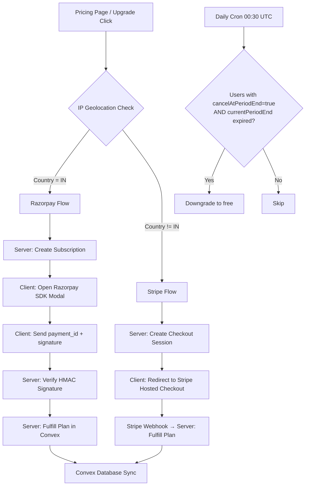

# Wekraft SaaS: Payment Integration & Webhook Guide

This comprehensive reference document details the architecture, configuration, testing procedures, and environment variables for the dual-payment integration (**Stripe** and **Razorpay**) inside Wekraft SaaS.

> **Last updated:** 2026-05-22 — Security hardening pass (auth on cancel/portal, HMAC fix, internalMutation, auto-downgrade cron)

---

## 1. High-Level Architecture Overview

Wekraft uses a dynamic, location-based payment routing engine. This architecture handles global cards via **Stripe** while routing Indian transactions through **Razorpay** to fully support local card mandates and UPI payment structures.



### Key Technical Decisions

1. **Server-Side Pricing Control:** All plans, amounts, and metadata are validated and configured on the server. The client cannot send custom pricing to prevent tampering.
2. **Authenticated Cancel & Portal Routes:** The `/api/payments/razorpay/cancel` and `/api/payments/stripe/portal` routes require a valid Clerk session **and** verify that the resource (subscriptionId / customerId) belongs to the authenticated caller before taking any action.
3. **Graceful Cancellations (No Instant Downgrades):** When users cancel, their premium plans remain active (`"pro"` or `"plus"`) with `cancelAtPeriodEnd: true` in Convex until their paid billing period (`currentPeriodEnd`) terminates. Downgrades to `"free"` happen via the `customer.subscription.deleted` webhook **and** the daily safety-net cron.
4. **Webhook Signature Security:** All webhook entry points use `crypto.timingSafeEqual` (Razorpay) and `stripe.webhooks.constructEvent` (Stripe) to prevent replay / spoofing. The Razorpay verify route will return `500` if `RAZORPAY_KEY_SECRET` is missing — it never falls back to an empty string.
5. **Plan Upgrade is Server-Only:** The `upgradeAccount` Convex mutation is an `internalMutation`. It cannot be called from any browser client — only from other Convex server functions (e.g., coupon redemption flows).

### Relevant File Structure

All payment-related logic is tightly organized into these specific files:

```text
wekraft-saas/
├── src/
│   ├── modules/web/Pricing.tsx                   # Frontend pricing UI, checkout triggers, location routing
│   ├── modules/payments/hooks/
│   │   ├── useRazorpay.ts                        # Razorpay client hook (modal, verification flow)
│   │   └── useStripeCheckout.ts                  # Stripe client hook (redirect to checkout session)
│   └── app/api/payments/                         # Next.js Serverless API Routes
│       ├── stripe/
│       │   ├── checkout/route.ts                 # Generates Stripe Checkout Session URL
│       │   ├── portal/route.ts                   # Generates Stripe Customer Portal URL (Cancel/Manage)
│       │   └── webhook/route.ts                  # Handles Stripe webhooks (checkout completed, deleted, etc)
│       └── razorpay/
│           ├── subscription/route.ts             # Calls Razorpay SDK to create a subscription order
│           ├── verify/route.ts                   # Validates HMAC signature, updates Convex DB on success
│           ├── cancel/route.ts                   # Issues cancel request to Razorpay, marks flag in DB
│           └── webhook/route.ts                  # Handles Razorpay webhooks (charged, cancelled, etc)
├── convex/                                       # Convex Backend & Database
│   ├── schema.ts                                 # 'users' table definition with all subscription fields
│   ├── stripe.ts                                 # Stripe database mutations (updatePlan, verifyOwner)
│   ├── razorpay.ts                               # Razorpay database mutations (updatePlan, verifyOwner)
│   ├── payments.ts                               # Cron job: downgradeExpiredPlans
│   └── crons.ts                                  # Cron scheduler (runs downgradeExpiredPlans daily)
└── Docs/
    └── payment_integration.md                    # This master guide
```

---

## 2. Dynamic Location-Based Routing

The entry point for payment selection resides in the frontend Pricing component (`src/modules/web/Pricing.tsx`):

### A. IP Geolocation Tracing
1. **Network Request:** On page load, the component executes a background fetch to the free `https://ipapi.co/json/` API.
2. **Data Extraction:** The API returns a JSON object containing the user's IP data, from which we extract `country_code` (e.g., `"US"`, `"IN"`, `"GB"`).
3. **Condition:** We evaluate `const isIndia = countryCode === "IN";`
4. **Dynamic Switch:** 
   - If `true`, prices render in Rupees (₹) and the checkout button routes to the **Razorpay** flow.
   - If `false`, prices render in Dollars ($) and the checkout routes to the **Stripe** flow.

**Production Warning:** The free tier of `ipapi.co` is highly rate-limited. If it fails or is blocked, the country code defaults to `null` (Stripe). To ensure Indian users don't get stuck with Stripe (which often fails on local cards/UPI), replace this with a robust solution like Vercel's `x-vercel-ip-country` header or a paid tier of `ipinfo.io` before scaling.

---

## 3. Stripe Integration Breakdown

Stripe is integrated completely server-side, using hosted Checkout Sessions and the Customer Billing Portal.

### A. Stripe Keys — Where to Get Them

Log into [Stripe Dashboard](https://dashboard.stripe.com/) and obtain:

1. **`STRIPE_SECRET_KEY` / `NEXT_PUBLIC_STRIPE_PUBLISHABLE_KEY`:** Developers → API Keys.
2. **`STRIPE_PLUS_PRICE_ID` / `STRIPE_PRO_PRICE_ID`:**
   - Go to **Product Catalog** → **Add Product**.
   - Create "Plus" ($7/mo) and "Pro" ($16/mo) as **recurring monthly** products.
   - Copy the **Price IDs** (starts with `price_...`). ⚠️ **Do NOT use the Product ID (`prod_...`)** — that will cause a hard error on every checkout.
3. **`STRIPE_WEBHOOK_SECRET`:** Generated when you create a webhook endpoint (see Section 3C).
4. **`STRIPE_SUCCESS_URL` / `STRIPE_CANCEL_URL`:** Set to your production domain URLs, not localhost.

### B. Local Webhook Testing (Stripe CLI)

There are two ways to authenticate the Stripe CLI and forward webhooks:

**Method 1: Browser Authentication**
```bash
# 1. Login to your Stripe account
stripe login
# (You MUST open the browser link provided in the terminal to authorize it)

# 2. Forward webhook events to your local server
stripe listen --forward-to localhost:3000/api/payments/stripe/webhook
```

**Method 2: API Key Bypass (Faster)**
If you don't want to use the browser, you can directly pass your Stripe Secret Key:
```bash
stripe listen --api-key sk_test_YOUR_SECRET_KEY --forward-to localhost:3000/api/payments/stripe/webhook
```

After running `stripe listen`, copy the `whsec_...` signing secret printed by the CLI ("Ready! Your webhook signing secret is whsec_...") and set it as `STRIPE_WEBHOOK_SECRET` in `.env.local`. Be sure to restart your `pnpm dev` server so it loads the new secret!

### C. Production Webhook Configuration

1. Go to **Developers → Webhooks → Add Endpoint**.
2. URL: `https://yourdomain.com/api/payments/stripe/webhook`
3. Select these events:
   - `checkout.session.completed` — initial payment fulfillment
   - `customer.subscription.updated` — scheduled cancellations, plan changes
   - `customer.subscription.deleted` — downgrade when billing term ends
4. Copy the **Signing Secret** → `STRIPE_WEBHOOK_SECRET` in production env.

### D. Stripe Billing Portal (Cancel / Manage)

The portal route (`/api/payments/stripe/portal`) is guarded:
1. Caller must be authenticated (Clerk session required → `401` otherwise).
2. The `customerId` in the request body is verified against the caller's Convex record via `api.stripe.verifyCustomerOwner` → `403` if mismatch.
3. Only then is a Stripe Billing Portal session created and the URL returned.

---

## 4. Razorpay Integration Breakdown

Razorpay uses a hybrid flow: subscription created on the server, processed on the client via the Razorpay Web SDK, then verified securely back on the server.

### A. Razorpay Keys — Where to Get Them

Log into [Razorpay Dashboard](https://dashboard.razorpay.com/):

1. **`NEXT_PUBLIC_RAZORPAY_KEY_ID` / `RAZORPAY_KEY_SECRET`:** Account & Settings → API Keys.
2. **`RAZORPAY_PLUS_PLAN_ID` / `RAZORPAY_PRO_PLAN_ID`:**
   - Go to **Subscriptions → Plans → Create Plan**.
   - Define the interval (monthly) and amount (₹649 / ₹1499).
   - Copy the Plan IDs (e.g., `plan_...`). ⚠️ **Do NOT use placeholder values** — the subscription creation will fail.
3. **`RAZORPAY_WEBHOOK_SECRET`:** Set when creating a webhook in Razorpay Dashboard (see Section 4C).

### B. Local Webhook Testing (ngrok)

Razorpay has no CLI forwarder — use ngrok to expose localhost:

```bash
ngrok http 3000
```

1. Copy the HTTPS URL (e.g., `https://xxxx-xx.ngrok-free.app`).
2. Razorpay Dashboard → Settings → Webhooks → Add New Webhook.
3. Webhook URL: `https://xxxx-xx.ngrok-free.app/api/payments/razorpay/webhook`
4. Set a strong **Webhook Secret** → `RAZORPAY_WEBHOOK_SECRET` in `.env.local`.
5. Active Events:
   - `subscription.charged`
   - `subscription.cancelled`
   - `subscription.halted`
   - `subscription.paused`
   - `subscription.resumed`

### C. Production Webhook Configuration

Update the Webhook URL to: `https://yourdomain.com/api/payments/razorpay/webhook`

### D. Razorpay Cancel Flow

The cancel route (`/api/payments/razorpay/cancel`) is guarded:
1. Caller must be authenticated (Clerk session required → `401` otherwise).
2. The `subscriptionId` in the request body is verified against the caller's Convex record via `api.razorpay.verifySubscriptionOwner` → `403` if mismatch.
3. Only then does `razorpay.subscriptions.cancel(subscriptionId, true)` execute. The `true` parameter is crucial—it commands Razorpay to cancel at the end of the billing cycle, not immediately.
4. Convex is updated immediately with `cancelAtPeriodEnd: true` so the UI reflects the cancellation (showing the "Ends on" pill) without waiting for the webhook.

### E. Razorpay Payment Signature Verification (Security)

The verify route (`/api/payments/razorpay/verify`) computes:
```
HMAC-SHA256(RAZORPAY_KEY_SECRET, razorpay_payment_id + "|" + razorpay_subscription_id)
```

**Critical rules enforced:**
- If `RAZORPAY_KEY_SECRET` is missing, the route returns `500`. It **never** falls back to an empty string (an empty HMAC key allows anyone to forge signatures).
- Signature comparison uses `crypto.timingSafeEqual` wrapped in `try/catch` — no pre-length-check is done (which would re-introduce a timing side channel).
- Proper API error introspection extracts exact Razorpay SDK error descriptions instead of generic `[object Object]` strings on the frontend.

---

## 5. Convex Database Architecture & Subscription Tracking

Both payment integrations feed into Convex. The exact status and remaining time of a user's subscription is continuously tracked and synced.

### A. User Document — Payment Fields

To support premium plans, the user document records:
- **Account Type**: The active plan tier (Free, Plus, or Pro).
- **Subscription Identifier**: The subscription ID generated by the payment provider (Stripe or Razorpay).
- **Customer Identifier**: The Stripe Customer ID (used exclusively for Stripe).
- **Subscription Status**: The status string returned by the provider (e.g. active, cancelled).
- **Provider**: Tracks which gateway processed the subscription (stripe or razorpay).
- **Period End Date**: Unix timestamp indicating the end of the paid cycle.
- **Cancel At Period End**: Boolean flag indicating if the subscription has been cancelled but remains active until the end of the current billing cycle.
- **Plan Expiry**: For temporary coupon-based upgrades.

### B. Tracking Cycle Ends & Cancellations (Graceful Downgrade Flow)

We employ **Graceful Cancellations**. Users are never downgraded instantly when they cancel; they retain premium features until the final second they paid for.

1. **Setting the Expiry Clock (`currentPeriodEnd`):**
   When a user's subscription is successfully charged, Stripe/Razorpay webhooks trigger `handleSubscriptionUpdate`. They send a timestamp (`current_period_end` or `current_end`). Convex multiplies this by 1000 (to make it a JS Date-compatible ms timestamp) and saves it to the user's `currentPeriodEnd`.

2. **Triggering the Cancel Intent:**
   - **Stripe:** User clicks cancel, modifies plan in Stripe Portal. Stripe webhook `customer.subscription.updated` patches Convex with `cancelAtPeriodEnd: true`.
   - **Razorpay:** User clicks cancel. API calls `razorpay.subscriptions.cancel(id, true)`. Convex is immediately patched with `cancelAtPeriodEnd: true`.
   - **UI Impact:** The `Pricing.tsx` UI sees this flag and replaces the Cancel Button with an orange pill: `"Ends on [Date]"`.

3. **Executing the Downgrade (End of Cycle):**
   - **Webhook Trigger:** Once the paid period expires, Stripe fires `customer.subscription.deleted`, and Razorpay fires `subscription.cancelled`. The webhooks catch this and immediately set `accountType: "free"`.
   - **Cron Trigger (Safety Net):** If the webhook fails to deliver due to an outage, the daily Cron at 00:30 UTC checks `if (cancelAtPeriodEnd === true && currentPeriodEnd < Date.now())` and forces the downgrade.

4. **Upgrading after Canceling:**
   If a user cancels (gaining the `cancelAtPeriodEnd: true` flag), but then changes their mind and re-purchases a Pro/Plus plan, the `updatePlanServerSide` mutation executes. It actively injects `cancelAtPeriodEnd: false` into the database patch. This wipes the old cancellation state clean, preventing the UI from falsely showing "Ends on...".

---

## 6. Auto-Downgrade Cron (Safety Net)

**File:** `convex/payments.ts` — `downgradeExpiredPlans`
**Schedule:** Daily at **00:30 UTC** (defined in `convex/crons.ts`)

This cron is the safety net for when provider webhooks are delayed or missed. It:
1. Queries all `plus` and `pro` users using the `by_accountType` index.
2. Filters those where `cancelAtPeriodEnd === true` AND `currentPeriodEnd < Date.now()`.
3. Patches matching users: `accountType → "free"`, `subscriptionStatus → "canceled"`, `cancelAtPeriodEnd → false`.

> **Important:** This cron runs **in addition to** (not instead of) webhook-based downgrades. Webhooks are the primary mechanism and fire in near-real-time; the cron is the daily catch-all.

---

## 7. Complete Environment Variable Reference

Add these to `.env.local` (local dev) and your production host (Vercel / Convex dashboard env vars).

| Variable | Required For | Source | Notes |
|----------|-------------|--------|-------|
| `NEXT_PUBLIC_RAZORPAY_KEY_ID` | Client SDK + verify route | Razorpay API Keys | `rzp_live_...` in production |
| `RAZORPAY_KEY_SECRET` | Server verify + cancel routes | Razorpay API Keys | Never expose to client. Missing = 500, not empty HMAC |
| `RAZORPAY_PLUS_PLAN_ID` | Subscription creation | Razorpay Plans | Must be real `plan_...` ID, not placeholder |
| `RAZORPAY_PRO_PLAN_ID` | Subscription creation | Razorpay Plans | Must be real `plan_...` ID, not placeholder |
| `RAZORPAY_WEBHOOK_SECRET` | Webhook signature verification | Razorpay Webhook Settings | Use a strong random secret |
| `STRIPE_SECRET_KEY` | All Stripe server routes | Stripe API Keys | `sk_live_...` in production |
| `NEXT_PUBLIC_STRIPE_PUBLISHABLE_KEY` | Reference only | Stripe API Keys | Currently unused client-side |
| `STRIPE_WEBHOOK_SECRET` | Stripe webhook verifier | Stripe CLI / Webhook Settings | `whsec_...` |
| `STRIPE_SUCCESS_URL` | Redirect after checkout | Your app URL | Use production URL, not localhost |
| `STRIPE_CANCEL_URL` | Redirect on checkout cancel | Your app URL | Use production URL, not localhost |
| `STRIPE_PLUS_PRICE_ID` | Stripe Checkout | Stripe Product Catalog | Must be `price_...`, NOT `prod_...` |
| `STRIPE_PRO_PRICE_ID` | Stripe Checkout | Stripe Product Catalog | Must be `price_...`, NOT `prod_...` |
| `BACKEND_SECRET` | Server-to-Convex auth | Generated 64-char hex | All payment mutations validate this |
| `NEXT_PUBLIC_CONVEX_URL` | ConvexHttpClient in API routes | Convex Dashboard | `https://xxx.convex.cloud` |

---

## 8. API Route Security Summary

| Route | Auth Required | Ownership Check | Notes |
|-------|-------------|-----------------|-------|
| `POST /api/payments/stripe/checkout` | ❌ No Clerk auth | — | User provides userId; rate limit recommended |
| `POST /api/payments/stripe/webhook` | ✅ Stripe signature | — | Public (webhooks are server-to-server) |
| `POST /api/payments/stripe/portal` | ✅ Clerk auth | ✅ customerId ownership | Returns 401 / 403 on violation |
| `POST /api/payments/razorpay/subscription` | ❌ No Clerk auth | — | Rate limit recommended |
| `POST /api/payments/razorpay/verify` | ❌ No Clerk auth | ✅ HMAC signature | Signature IS the proof of payment |
| `POST /api/payments/razorpay/cancel` | ✅ Clerk auth | ✅ subscriptionId ownership | Returns 401 / 403 on violation |
| `POST /api/payments/razorpay/webhook` | ✅ Razorpay HMAC signature | — | Public (webhooks are server-to-server) |

---

## 9. Adding New Plans (Future Expansion)

To add a new tier (e.g., "Enterprise"):

1. **Schema:** Add `v.literal("enterprise")` to `accountType` in `convex/schema.ts`.
2. **Plan limits:** Add `enterprise` entry to `PLAN_CONFIGS` in `convex/pricing.ts`.
3. **Stripe:** Create product in Stripe → get `price_...` ID → set `STRIPE_ENTERPRISE_PRICE_ID`.
4. **Razorpay:** Create plan in Razorpay → get `plan_...` ID → set `RAZORPAY_ENTERPRISE_PLAN_ID`.
5. **Checkout route:** Add `planType === "enterprise"` branch in `stripe/checkout/route.ts` and `razorpay/subscription/route.ts`.
6. **UI:** Add new plan object to the `plans` array in `src/modules/web/Pricing.tsx`.
7. **Convex mutations:** Update `updatePlanServerSide` arg validators in `stripe.ts` and `razorpay.ts` to accept `"enterprise"`.
