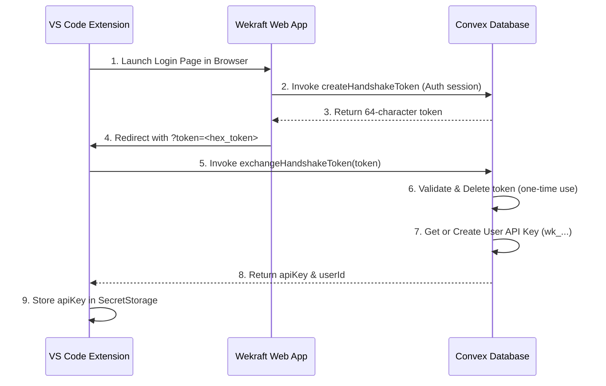

# API & Integrations

Integrate Wekraft data into your developer portals, custom scripts, or external tools. Wekraft exposes public APIs and a secure handshake protocol to power external integrations.

---

## 1. Public Project Metadata API

Wekraft provides a public JSON endpoint to retrieve project profiles, language distributions, and repository health metrics.

### Request Specification
- **URL**: `/api/public/slug`
- **Method**: `GET`
- **Query Parameters**:
  - `slug` (string, required): The unique project URL slug identifier (e.g. `my-team-project`).

### Caching and Architecture
- **Redis Cache Layer**: To ensure high performance, Wekraft caches the compiled project metadata in Redis (TTL = 30 minutes). Cache hits bypass database and GitHub API requests completely.
- **GitHub Sync**: For public projects containing a connected repository, the endpoint fetches real-time repository stats (programming language breakdown and health indicators) directly via the GitHub API before fanning out the response.

### Response Schema

#### Public Project Response (`200 OK`)
```json
{
  "profile": {
    "_id": "project_id_123",
    "projectName": "Sample Project",
    "slug": "sample-project",
    "isPrivate": false,
    "repo": {
      "repoOwner": "github-username",
      "repoName": "github-repo-name"
    },
    "ownerClerkId": "user_clerk_id"
  },
  "languages": {
    "TypeScript": 145020,
    "CSS": 12500,
    "HTML": 8300
  },
  "health": {
    "openIssues": 12,
    "lastCommit": "2026-06-03T18:42:00Z",
    "activePullRequests": 3
  }
}
```

#### Private Project Response (`200 OK`)
If the requested project has `isPrivate: true` in its settings, Wekraft restricts external analytics. The endpoint returns the profile data without linking GitHub metadata:
```json
{
  "profile": {
    "_id": "private_project_id_456",
    "projectName": "Internal Dashboard",
    "slug": "internal-dashboard",
    "isPrivate": true,
    "ownerClerkId": "user_clerk_id"
  },
  "languages": null,
  "health": null
}
```

#### Error States
- `400 Bad Request`: `{"error": "slug is required"}`
- `404 Not Found`: `{"error": "Project not found"}`
- `500 Server Error`: `{"error": "Failed to fetch project"}`

---

## 2. VS Code Extension Authentication Handshake

The Wekraft VS Code Extension connects to your developer workspace using a secure, zero-copy **Authentication Handshake** protocol to provision your permanent API Key (`wk_...`).

### The Handshake Sequence



### Protocol Mechanics

#### A. Token Generation (`createHandshakeToken`)
When authenticating, the Wekraft web application calls `createHandshakeToken`. 
- **Token Format**: A cryptographically secure random 64-character hex string.
- **TTL Constraint**: Token expires exactly **5 minutes** after insertion.
- **Table Registry**: Registered in the `handshakeTokens` schema table.

#### B. Token Exchange (`exchangeHandshakeToken`)
The VS Code Extension captures the token from the redirect URL and calls the `exchangeHandshakeToken` mutation:
- **Immediate Deletion**: The token is **deleted from the database immediately** upon check, ensuring it is strictly single-use.
- **API Key Provisioning**: If a permanent API key (`wk_...`) does not exist for the user in `userApiKeys`, it is generated:
  - **API Key Format**: `wk_` prefix followed by a cryptographically random 64-character hex string.
- **Storage**: The API key is transferred to the extension and saved securely inside VS Code's encrypted secret storage.

---

## Next Steps

- [Install and set up the VS Code Extension →](/web/docs/extension)
- [Connect your GitHub Repositories →](/web/docs/repositories)
- [Review security permissions and RBAC →](/web/docs/security)
- [Refer teams and track your rewards →](/web/docs/referrals)
