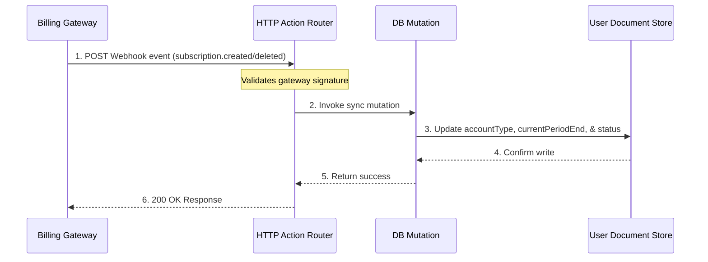

# Billing & Subscriptions

WeKraft uses a multi-tier SaaS subscription model governed by server-side limit verifications. Features and resources are scaled across three plans: **Free**, **Plus**, and **Pro**.

---

## Plan Comparison Matrix

All capabilities and data volume metrics are checked dynamically at the database layer.

| Feature / Limit | Free Plan | Plus Plan | Pro Plan |
| :--- | :--- | :--- | :--- |
| **Monthly Cost** | $0 | $12 / member | $25 / member |
| **Owned Project Limit** | Max 2 projects | Max 10 projects | Max 20 projects |
| **Joined Project Limit** | Max 2 projects | Max 10 projects | Max 20 projects |
| **Members Per Project** | Max 3 members | Max 6 members | Max 15 members |
| **Cloud Storage Allocation** | 2 GB | 15 GB | 30 GB |
| **Kaya AI PM Agent** | Disabled | Disabled | Full access (360 calls/mo) |
| **Harry AI Dev Agent** | Disabled | Disabled | Beta Access (Coming Soon) |
| **Editor Sync Mode** | Read-Only | Read-Only | Full Two-Way Sync |
| **Interactive Heatmaps** | Basic structure | Git activity view | Git activity & issue overlay |
| **Dedicated Support** | Basic Support | Basic Support | Priority 24/7 Support |
| **Automated Reports** | No | No | Yes |

---

## Server-Side Limit Enforcements (Technical Rules)

Usage metrics are validated via server-side database rules. Key checks include:

### 1. Active Plan Evaluation
The system evaluates plan states at runtime rather than relying on static flags:
- Checks plan expiration fields for temporary upgrades or trials.
- Checks if the user cancelled the subscription. If the current time exceeds the paid period end timestamp, the account is automatically downgraded to free.
- Evaluates whether subscriptions are in past due or cancelled states to trigger grace periods.

### 2. Project Creation & Member Seats Checks
- **Project Limits**: Prior to inserting a project, a query checks the count of owned projects. If the count meets the plan threshold (2 for Free, 10 for Plus), the creation mutation is rejected with an error.
- **Member Approval**: Approving a join request validates the number of current members against the project owner's active plan tier.

### 3. Storage Allocation Enforcements
- File uploads to team channels or task attachments calculate file sizes in bytes.
- The user's total active storage is cached on the user document.
- If an upload causes the size to exceed the tier threshold (e.g. 2 GB for Free), the storage mutation is rejected.

### 4. AI Credit Caps
- Every message query targeting the AI PM agent increments active usage on the user profile.
- Pro users are capped at **360 queries per billing cycle**.
- The limit is checked during the API gateway call; if the quota is exhausted, responses are blocked, and an exhaustion notice is returned.

---

## Webhook Sync Architectures

WeKraft maintains billing state consistency by processing webhook events emitted from payment gateways via the backend HTTP routers:

### Webhook Event Processing Map:
- **`subscription.created` / `subscription.activated`**: Upgrades the user's account type, sets the billing gateway details, maps the unique subscription reference, and computes the billing period end timestamp.
- **`subscription.cancelled` / `subscription.deleted`**: Triggers a downgrade. If cancelled, it flags cancel-at-period-end status and allows access to continue until the paid period terminates.
- **`subscription.charge.failed`**: If a renewal payment fails, the subscription moves to past due or unpaid status. WeKraft initiates a 3-day grace period, after which a background job automatically downgrades the user to the Free plan.
- **Cron Re-verification Safety**: A recurring server cron scans users with active subscriptions. If a subscription period is in the past and no payment webhook has arrived, it automatically verifies the status with the gateway API and synchronizes the account.
