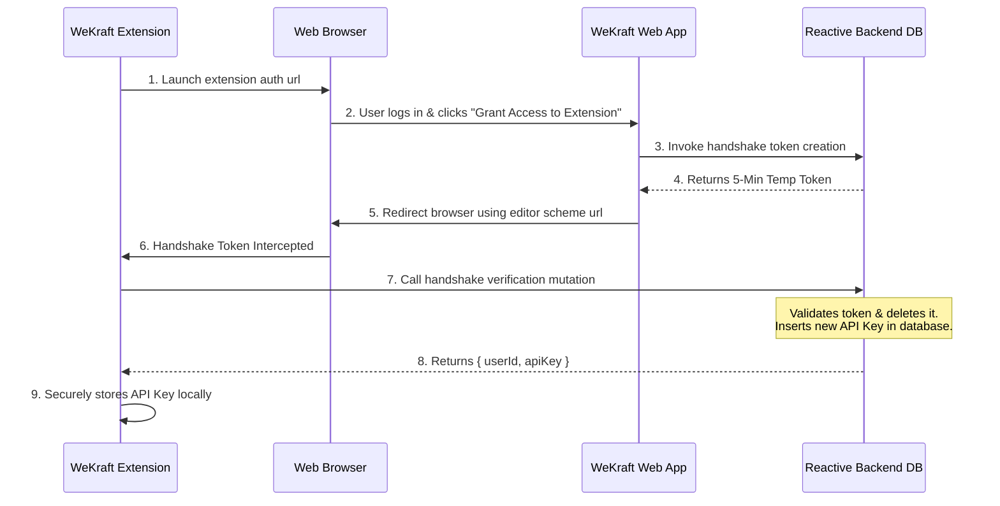

# IDE Extension

The **WeKraft IDE Extension** is a developer-first workspace companion. It brings your WeKraft workspace — projects, active sprints, tasks, issues, and tickets — directly into your code editor, so you never have to break your flow or switch context to a browser.

> **Free for Everyone** — The WeKraft Extension is completely free for all users, no plan restrictions. Every WeKraft user gets full extension access.

---

## Features

### ✅ Project & Sprint Management
- View all your **projects** and their active **sprints** directly in the editor sidebar.
- Switch between projects without leaving the editor.

### ✅ Task & Issue Tracking
- Browse the full **task and issue backlog** for any project.
- View task details including title, description, priority, status, assignees, and codebase links.
- **Update task and issue statuses** directly from the editor (e.g., move a task from `Not Started` → `In Progress` → `Completed`).
- Create and edit tasks or issues directly from the extension panel.
- Mark tasks as blocked (Mark as Issue) to escalate task blockages immediately.
- Delete tasks and issues.

### ✅ Codebase File Navigation
- Tasks and issues linked to specific files (e.g., `src/components/Navbar.tsx`) render as **clickable file links** inside the extension.
- Click a file link to instantly open that file in your active editor workspace — no manual searching.

### ✅ Chat Ticket Management
- Access the **tickets list** for your projects.
- View open and closed tickets.
- Close or reopen tickets directly without leaving the development workspace.

---

## What You Cannot Do

### ❌ Create New Projects or Sprints
- Project and sprint creation must be done through the **WeKraft web dashboard**. The extension is scoped to viewing and acting on existing work.

### ❌ Manage Workspace Members or Roles
- Inviting members, changing roles, or managing workspace permissions is only available in the **web dashboard settings**.

### ❌ Reply to Chat Tickets or Create Customer Desk Requests
- Ticket comments, client communications, and Service Requests are managed via the web client (Teamspace and Customer Desk views).

### ❌ Billing & Plan Management
- Subscription, billing, and plan upgrades are accessible only through the **WeKraft web dashboard**.

---

## Handshake Authentication Flow

WeKraft authenticates extension clients securely using a deep-linked handshake protocol that generates a cryptographically signed API key without requiring password exposure:

### Authentication Lifecycle Details
1. **Initiate**: Select **"Login with WeKraft"** in the extension Activity Bar. This launches your default browser with the callback redirect parameters.
2. **Authorize**: Authenticated users click **"Grant Access to Extension"** in the browser.
3. **Generate Token**: The web app invokes a database mutation to insert a handshake record with a **5-minute Time-To-Live (TTL)**.
4. **Deep-Link Redirection**: The browser redirects to the custom editor URI scheme.
5. **Exchange**: The extension catches the deep-link parameters and calls the backend endpoint to exchange the token. On success, this generates a permanent key in the API keys table, revokes the handshake token, and returns `{ userId, apiKey }`.
