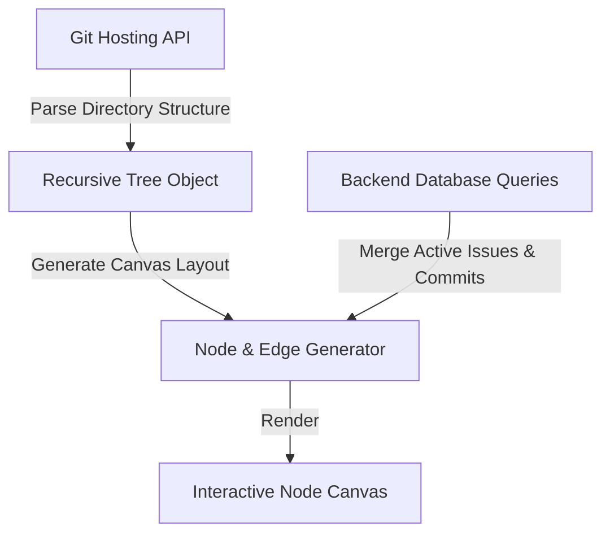

# Codebase Map

The **Heatmaps** module displays an interactive, codebase-aware visual map of your repository. Built on an interactive **node graph library**, it translates directory trees, file structures, git commits, and outstanding bug tickets into a node graph, providing visual codebase metrics.

---

## Codebase Tree Parsing & Canvas Rendering

WeKraft converts repository file systems into interactive canvas nodes:

1. **Structure Parsing**: The repository file tree is fetched via the hosting provider's API and parsed recursively into a nested JSON structure.
2. **Layout Calculation**: Nodes represent directories and files. Edges represent path linkages (parent-to-child directory branches). The coordinate placement is calculated dynamically to avoid overlapping.
3. **Interactive Navigation**: Users can scroll to zoom, drag the canvas to pan, and click a zoom-to-fit trigger to center the codebase tree. Folder nodes support collapse and expand triggers; collapsing a parent folder temporarily hides child branches and recalculates canvas layout.

---

## Directory Activity & Heatmap Color Rules

Folder and file nodes are colored dynamically based on live database metrics:

| Node Color | State Class | Condition | Rationale |
| :--- | :--- | :--- | :--- |
| **Red** | `Active Issues` | Outstanding issues exist where the linked file matches the folder path or prefix, and status is not closed. | Alerts developers to buggy codebase modules, preventing further task additions to unstable components. |
| **Yellow** | `Recent Commits` | Commit records indicate changes in files under this directory tree within the last 7 calendar days. | Identifies active work zones, helping team members track where code changes are compounding. |
| **Blue / Gray**| `Stable / Idle` | No active issues or commits recorded within the 7-day window. | Represents stable, verified modules that are idle. |

---

## The Heatmap Dashboard Panel

A side dashboard panel anchors Git actions and lists file metrics:

- **Repository Card**: Renders the repository path. Clicking the card launches the linked repository on the hosting provider in a new tab.
- **Issues Directory**: Aggregates all open issues, displaying assignee avatars and the path of the linked file.
- **Interactive File Tree**: A collapsible directory tree in list form. Selecting a file node from this tree highlights its corresponding node on the interactive canvas. Clicking a file icon navigates to the file view on the hosting provider.
- **Commit History**: Renders a scrollable list of recent repository commits, showing commit hashes, author names, and messages.

---

## Plan Limits & Tier Enforcements

Database structures and highlight overlays are gated by user subscription tiers:

### 1. Free Tier
- Maps the repository layout structure but collapses sub-directories beyond a depth of 2 levels.
- **Overlays Disabled**: All nodes render in a uniform neutral gray. Git commit history lists and active issue color highlights (Red/Yellow alert status) are locked.
- Clicking locked panels displays a subscription upgrade modal.

### 2. Plus Tier
- Full directory depth rendering and canvas expansion.
- Yellow node highlights (recent commits within 7 days) and commit lists are active.
- Red node highlights (issue alerts) are disabled.

### 3. Pro Tier
- Complete map features enabled, including full codebase structure depth, yellow commit alerts, and red issue overlay tags.
- Enables two-way navigation: clicking a canvas node launches the local editor directly to that file path if the editor handshake is active.
