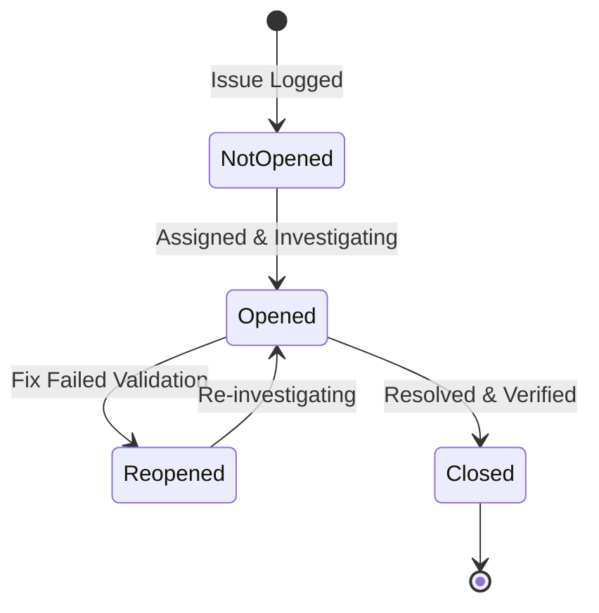

# Issues & Bug Tracking

Issues represent reactive or unplanned work in WeKraft, such as application bugs, server crashes, environment failures, or security hotfixes. They operate outside the planned sprint backlog but can be allocated to sprints for tracking alongside planned tasks.

---

## Sub-topics

To help you manage incidents and bugs, the WeKraft Issues system is broken down into the following operational guides:

- **[Create Issues](/web/docs/create-issues)**: Step-by-step guides on logging bugs manually, via blocked task escalation, or via manual GitHub import.
- **[Edit Issues](/web/docs/edit-issues)**: How to modify issue properties, update severity, change status lifecycles, and edit linked files.
- **[Assign Issues](/web/docs/assign-issues)**: How to allocate issues to developers and sync assignees across blockers.

---

## Issue Properties

Every issue contains the following fields:

- **Title**: A summary detailing the bug report or incident.
- **Description**: Optional details containing steps to reproduce, logs, or system specs.
- **Impact Environment**: Indicates where the issue was detected (`local`, `dev`, `staging`, or `production`).
- **Severity**: Dictates the urgency and response priority (`critical`, `medium`, or `low`).
- **File Linked**: Path pointing to the buggy component.
- **Due Date**: Target resolution deadline.
- **Source Type**: Identifies how the issue was ingested (`manual`, `task-issue`, or `github`).

---

## The Issue Lifecycle

Issues transition through the following states:

- **Not Opened (`not opened`)**: Logged in backlog, investigation has not begun.
- **Opened (`opened`)**: Assigned developer is debugging and testing a resolution.
- **Reopened (`reopened`)**: The patch failed staging tests, or the bug recurred in production, reopening the incident.
- **Closed (`closed`)**: The bug is resolved. Closing the issue records the completion timestamp and user ID.
