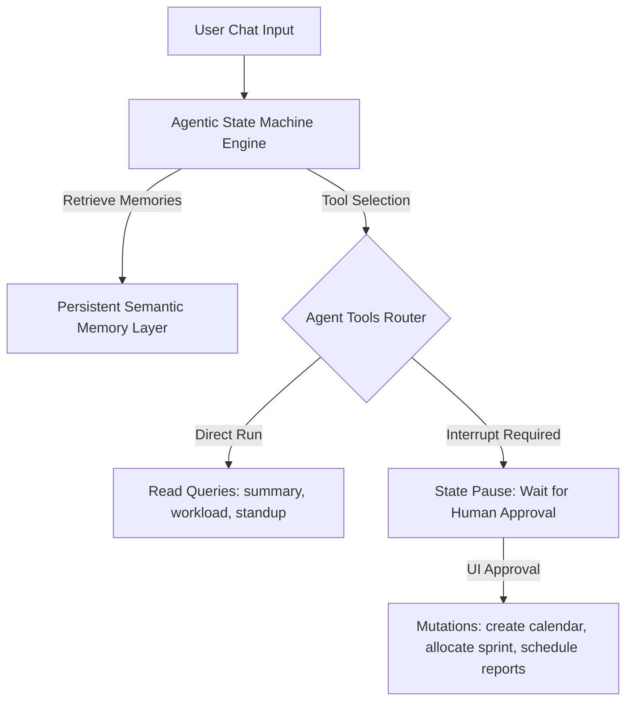

# Kaya PM Agent

**Kaya** is WeKraft's autonomous AI Product Manager agent. Deeply integrated with the backend database, project channel histories, and developer tool chains, Kaya acts as a virtual project manager. She assists teams with sprint planning, calendar coordination, reporting automation, and backlog grooming.

---

## Architecture & Cognitive Layers

Kaya is constructed on an agentic cognitive loop combining runtime execution graphs with a persistent memory fabric:

### 1. Agentic State Machine Engine
Kaya's cognitive reasoning cycles are governed by an **Agentic State Machine Engine**. Graph nodes process user queries, classify intent, fetch database context, and coordinate tool invocation. If a write action is requested, the execution pauses and emits an **Interrupt State**, which is rendered in the user's chat interface.

### 2. Semantic Memory Layer
Unlike typical chatbots limited to short-term session memory, Kaya leverages a **Persistent Semantic Memory Layer**. This layer indexes user interactions and extracts structured facts:
- **Domain Context**: E.g., *"Alice is developing a B2B SaaS fintech platform."*
- **Engineering Stack**: E.g., *"The project uses Next.js, Tailwind CSS, and a serverless database backend."*
- **Backlog Decisions**: E.g., *"The team decided to defer the payment gateway export feature to Sprint 3."*
These memories are injected into Kaya's system prompt during queries, enabling hyper-personalized task breakdowns and sprint planning.

---

## Interactive Interrupt Cards

For operations that modify project states, Kaya enters an interrupt state. The operation halts and displays a specialized card inside the chat panel. The execution only resumes after a human operator clicks a button:

### 1. Calendar Event Approval Card
- **Trigger**: The user requests a meeting, standup, or demo scheduled (e.g., *"Schedule a design sync with Ronit tomorrow at 10 AM"*), invoking the calendar event creation tool.
- **Interrupt Card**: Renders the proposed event title, description, start/end dates, and a toggle for all-day duration.
- **Action**: Clicking **"Approve"** executes the database mutation, writing to the calendar events table. Clicking **"Reject"** cancels the action.

### 2. Sprint Backlog Allocation Card
- **Trigger**: The user commands Kaya to plan a sprint backlog (e.g., *"Plan our next sprint with critical bugs"*), invoking the backlog allocation tool.
- **Interrupt Card**: Lists eligible backlog tasks and issues side-by-side with priorities and due dates.
- **Action**: Users can check/uncheck individual rows before clicking **"Confirm Allocation"** to write the batch mapping to the active sprint.

### 3. Reporting Scheduler Card
- **Trigger**: The user requests status updates automation (e.g., *"Send a weekly project summary report to our stakeholders"*), invoking the reporting scheduler tool.
- **Interrupt Card**: Displays options for frequency (daily, weekly, bi-weekly), target channel, recipient emails, and report focus (sprints, tasks, heatmaps).
- **Action**: Users review and approve to insert the job config into the schedulers table.

---

## Workspace Integration Points

- **AI Workspace Tab (`/workspace/ai?kaya=true`)**: A full chat screen that supports selecting model profiles:
  - `Kaya Fast`: High-speed, lower latency queries for search and simple summaries.
  - `Kaya Pro`: Deep-reasoning model optimized for generating PRDs, backlog grooming, and complex report scheduling.
- **Teamspace Channels**: Mentioning `@kaya` in any chat channel triggers a webhook that reads the channel logs to provide contextual responses.
- **Right Sidebar Widget (`RightSidebar.tsx`)**: Renders a radial progress chart tracking the current project's monthly Kaya call volume.

---

## Tier Access & Governance

- **Plan Requirement**: Kaya is available exclusively to projects owned by a **Pro Plan** user. If a project owner is on a Free or Plus plan, Kaya chat views display a premium upgrade wall.
- **Governance Controls**: Project owners can toggle team member access to Kaya. By switching **"Member AI Access (Kaya)"** in the Workspace Config panel, owners restrict/allow other members to query Kaya, protecting monthly credit allocations.
