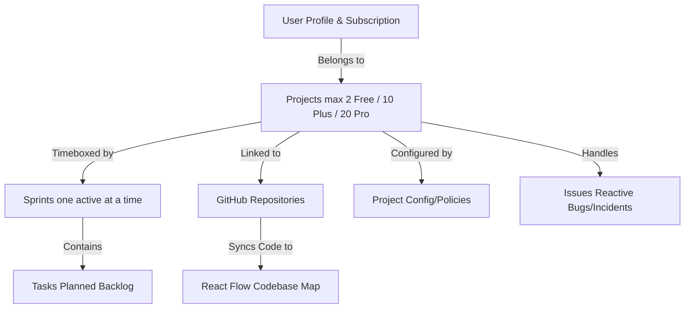

# Wekraft Platform Overview

Welcome to **Wekraft** — the unified software engineering and collaboration platform. Wekraft bridges the gap between where your work is planned and where it is built. By bringing **project planning**, **real-time team communication**, **git metrics**, and **editor-level integrations** into one unified, real-time environment, Wekraft eliminates traditional context-switching.

---

## Technical Architecture & Flow

Wekraft operates in a hierarchical model designed to mirror standard engineering team organizations:

1. **User Accounts & Billing**: Every user belongs to a plan tier (**Free**, **Plus**, or **Pro**) which governs limits across all projects they own or join.
2. **Projects**: The top-level workspace container. Each project can link to a GitHub repository, invite members, and toggle governance settings.
3. **Sprints & Backlog**: Time-boxed execution periods. Tasks are planned within sprints.
4. **Tasks & Issues**: Tasks represent planned milestones; Issues represent reactive bugs or incidents.
5. **Team Communication**: Embedded chat channels and real-time video meetings inside the workspace.

---

## Subscription Plans & Feature Support

All usage limits are enforced both server-side via Convex and client-side in the dashboard:

| Feature / Limit | Free Plan | Plus Plan | Pro Plan |
| :--- | :--- | :--- | :--- |
| **Created Projects Limit** | 2 projects | 10 projects | 20 projects |
| **Joined Projects Limit** | 2 projects | 10 projects | 20 projects |
| **Members Per Project** | Max 3 members | Max 6 members | Max 15 members |
| **Kaya AI PM Agent** | Not available | Not available | Full access (360 calls/mo) |
| **Harry AI Dev Agent** | Not available | Not available | Beta Access (Coming Soon) |
| **Interactive Heatmaps** | Read-only structure | Full Structure & Git activity | Full structures & issue overlay |
| **VS Code Sync** | Read-only extension | Read-only extension | Full Two-way editor sync |
| **Cloud Storage** | 2 GB | 15 GB | 30 GB |
| **Support SLA** | Basic | Basic | Priority 24/7 |

---

## Frequently Asked Questions

### What happens when I hit my member limit?
If you hit your project's member limit (e.g., 3 members on the Free plan), any incoming join requests will show as pending but cannot be approved until you either remove an existing member or upgrade your subscription plan.

### Can team members configure project settings?
Wekraft maintains a strict distinction:
- **Project Settings** (names, public/private visibility, descriptive tags) are managed on the Project Home page and restricted to the **Project Owner**.
- **Workspace Configs** (Member task creation, Member AI access policies) are configured in the Workspace sub-tab.

---

## Next Steps

- Get started in 5 minutes with the [Getting Started Tutorial](/web/docs/getting-started).
- Learn about the [Project Home Settings & Configs](/web/docs/projects).
- Explore interactive code tracking in [Repository Heatmaps](/web/docs/heatmaps).
- Review [VS Code Extension Setup](/web/docs/extension).
