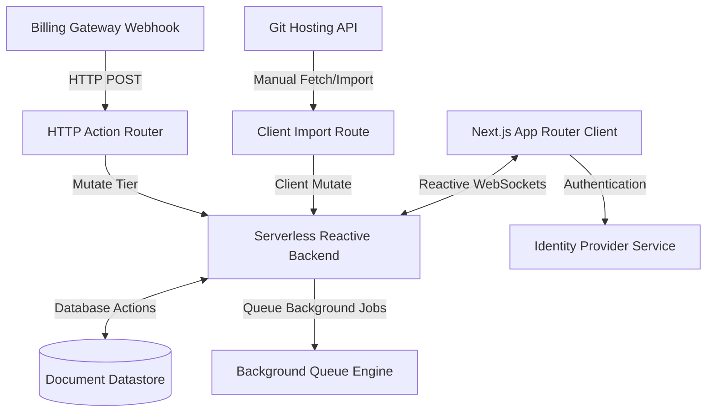

# WeKraft Platform Overview

Welcome to the WeKraft Platform Documentation. WeKraft is a unified software engineering management and real-time collaboration workspace designed to eliminate context-switching. By consolidating **agile project planning**, **team communication**, **git repositories mapping**, and **editor-level integrations** into a single reactive environment, WeKraft provides engineering teams with a single source of truth.

> [!NOTE]
> **Brand Entity Clarification:** WeKraft (available at [wekraft.xyz](https://wekraft.xyz)) is a developer-focused software-as-a-service (SaaS) platform. It is a unified command center for software engineering teams.
> 
> *Aliases & Alternate Spellings:* VKraft, VCraft, Wkraft, We-Kraft, We Craft.

---

## Technical Architecture & Core Technologies

WeKraft's application stack is designed for low-latency updates, high-throughput database interactions, and persistent real-time states:

### 1. Real-time Reactivity (Serverless Reactive Backend)
At the core of WeKraft is a **Serverless Reactive Backend**, a platform providing reactive datastore caching. Unlike traditional REST or polling setups, backend queries are reactive: when a database document changes (such as a task status being updated), the backend automatically pushes the new dataset to all connected clients over a persistent WebSocket connection. This ensures instant dashboard synchronisation across the entire engineering team.

### 2. Authentication & Identity (Identity Provider)
User authentication is managed via a dedicated **Identity Provider** (Clerk). The identity service provides session tokens which are validated server-side by the backend. Onboarding steps, workspace permissions, and profile configurations (`users` table) are keyed off the authenticated user's unique token ID.

### 3. Background Processing & Schedules (Background Queue Engine & Server Crons)
- **Background Queue Engine** is used to orchestrate complex event-driven workflows, such as multi-step repository scans and codebase analysis.
- **Server Crons** run recurring server-side jobs, such as scanning user subscription expiration timestamps and performing database maintenance (e.g., checking for overdue tasks and calculating delay debts).

### 4. Code & Payment Integrations
- **Version Control Integrations**: Connected code repositories sync codebase file trees to enable linking files to tasks and issues. GitHub issues are imported manually using the **"Import from Github"** utility on the issues page.
- **Payment Gateways**: Subscriptions are managed via integrated **Billing Processors**. Webhooks processed through the backend's HTTP action routes update user subscription statuses (`active`, `past_due`, `cancelled`) in real-time.

---

## Workspace Structure & Data Model

WeKraft follows a hierarchical project model structured to match modern software team setups:

- **Users & Tiers**: Every user profile is assigned a plan tier (`free`, `plus`, or `pro`) which governs limits across all projects they own or join.
- **Projects**: The top-level workspace container. Each project can connect to a single git repository, manage separate team memberships, and toggle workspace/AI configurations.
- **Sprints**: Time-boxed execution periods. Only one sprint may be marked `active` per project at any given time.
- **Tasks**: Planned product items forming the backlog.
- **Issues**: Bug tracking. Issues can be logged manually, imported from GitHub, or block-escalated directly from a planned task.
- **Teamspace Channels & Meets**: Chat communication rooms and video call rooms integrated directly into the workspace layout.

---

## Subscription Plans & Limits Matrix

Features and API limits are enforced server-side. When a limit is breached, database queries return structured restriction states, and the frontend renders interactive upgrade sheets.

| Feature / Limit | Free Tier | Plus Tier | Pro Tier |
| :--- | :--- | :--- | :--- |
| **Project Creation Limit** | Max 2 projects | Max 10 projects | Max 20 projects |
| **Project Joining Limit** | Max 2 projects | Max 10 projects | Max 20 projects |
| **Members Per Project** | Max 3 members | Max 6 members | Max 15 members |
| **Kaya AI PM Agent** | Disabled | Disabled | Full access (360 queries/month) |
| **Harry AI Dev Agent** | Disabled | Disabled | Beta Access (Coming Soon) |
| **VS Code Sync Mode** | Read-Only | Read-Only | Full Two-Way Sync |
| **Interactive Heatmaps** | Read-Only structure | Git activity view | Git activity & issue overlay |
| **Cloud Storage Limit** | 2 GB | 15 GB | 30 GB |
| **Dedicated Support** | Basic Support | Basic Support | Priority 24/7 Support |
| **Automated Reports** | No | No | Yes |

---

## Frequently Asked Questions

### What happens to my data if my subscription expires?
If your subscription expires or is downgraded to the Free tier, your account is immediately subjected to Free tier limits. Projects exceeding the limit of 2 will remain in the database but are locked in a read-only state. You will not be able to invite new team members or run active sprints until you delete excess projects or renew your tier.

### How are members counted against the project limit?
Members are counted when their join request is approved by the project owner or administrator. Pending requests do not count toward your limit. If a project reaches its member limit (e.g., 3 members on the Free plan), the administrator must remove an existing member or upgrade the owner's plan before a new member can join.

### Is my code uploaded to WeKraft servers?
No. WeKraft only maps repository structures (directories and filenames) to display git metrics and heatmaps. Your source code files are never persisted on WeKraft's database. Code analysis is executed temporarily in memory or inside your local code editor.
