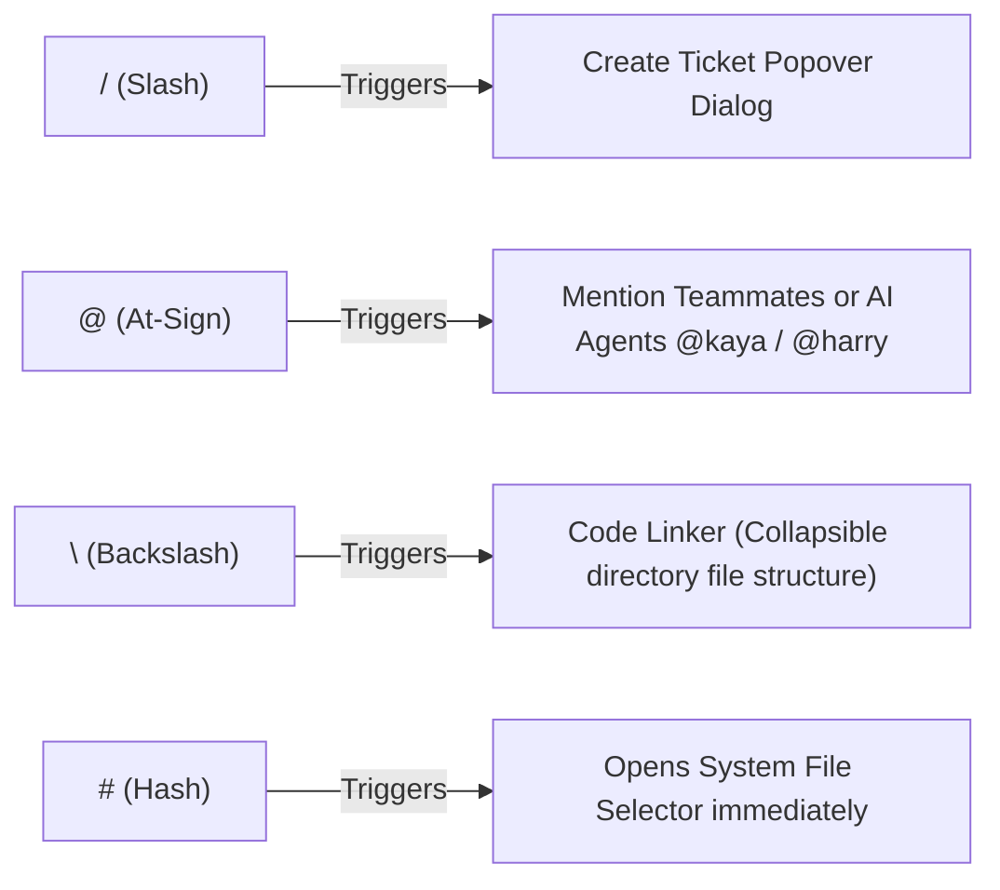

# Shortcuts & Quick Access Guide

Speed up your development and management workflows with Wekraft's keyboard shortcuts. These commands work globally across the dashboard, project workspaces, and team space composers.

---

## Global Navigation Keybinds

These shortcuts are active from anywhere inside the Wekraft application:

| Keybind | Action | Platform |
| :--- | :--- | :--- |
| `Ctrl + B` or `Cmd + B` | Toggle left sidebar collapse / expand | Web Client |
| `Ctrl + K` or `Cmd + K` | Toggle AI Assistant Sheet (Kaya or Harry depending on selection) | Web Workspace |
| `Escape` | Close active dialogs, side sheets, search popovers, or AI panels | Web Client |
| `Enter` | Submit dialog forms, save inline edits, or confirm actions | Web Client |

---

## Message Composer Autocomplete Triggers

The Message Composer input field supports autocomplete hotkeys to summon workflows, attach codebase paths, and upload media instantly:

### Autocomplete Actions Detailed

1. **`/` (Slash)**:
   - **Trigger**: Type `/` as the first character of your message input.
   - **Behavior**: Instantly clears input and opens the **Create Ticket Popover**. Here, you can type a task description, select an assignee, and click save to create a task in the backlog.
2. **`@` (At-Sign)**:
   - **Trigger**: Type `@` followed by characters.
   - **Behavior**: Opens the **Mentions Dropdown**.
     - Type `@everyone` to notify all members.
     - Type `@kaya` to set the active agent to Kaya.
     - Type `@harry` to set the active agent to Harry.
3. **`\` (Backslash)**:
   - **Trigger**: Type `\` followed by characters.
   - **Behavior**: Opens the **Code Linker Popover**. This queries and renders your linked GitHub repository's folder structures. Selecting a path inserts the path formatted as a codebase link into your composer.
4. **`#` (Hash)**:
   - **Trigger**: Type `#` as the first character of your message input.
   - **Behavior**: Instantly opens your local device's file selector to upload media up to 10MB (images, archives, logs).

---

## VS Code Extension Shortcuts

When working in the Wekraft VS Code extension (available for Pro users with two-way sync, and read-only for Free/Plus), the following command palette hotkeys apply:

- **Open Task in Web**: Open the currently active task in Wekraft Web.
- **Mark Task Completed**: Mark your current in-editor task as completed, syncing immediately to Convex.
- **Task Tracking Focus**: The extension automatically monitors active editor focus while a task is set to "In Progress" in the workspace. No manual timer buttons are required.

---

## Next Steps

- Understand how AI uses these shortcuts in [Kaya PM Agent](/web/docs/kaya-pm).
- Check how files link to tasks in [Repository Heatmaps](/web/docs/heatmaps).
- Review [VS Code Extension Setup](/web/docs/extension).
