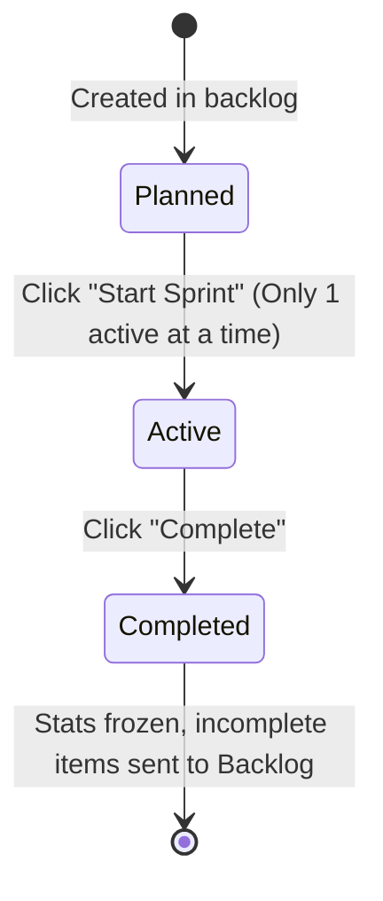

# Sprints

Sprints in WeKraft are time-boxed execution periods—typically spanning 1 to 2 weeks—during which your team commits to delivering a set of planned tasks and resolving open issues.

---

## Sub-topics

To help you manage and configure team sprints, see the following operational guides:

- **[Create Sprints](/web/docs/create-sprints)**: Step-by-step instructions on setting sprint goals, defining date ranges, and adding backlog items.
- **[Edit Sprints](/web/docs/edit-sprints)**: How to activate or complete sprints, and track active sprint metrics.
- **[Assign Sprints](/web/docs/assign-sprints)**: How to allocate items within a sprint and monitor member commitments.

---

## The Sprint Lifecycle

Every sprint transitions through exactly three states:

1. **Planned**: Sprints are created from the Sprints dashboard. Developers add tasks or issues from the backlog list into the planned sprint's detail page dialog.
2. **Active**: Work begins. WeKraft monitors task movements. **Only one sprint can be active per project.**
3. **Completed**: The active sprint is closed by the project owner or administrator. WeKraft automatically performs cleanups:
   - Freezes the completion statistics (completed tasks vs total tasks, closed issues vs total issues) for analytics.
   - Automatically returns any incomplete tasks or open issues back to the project **Backlog**.
