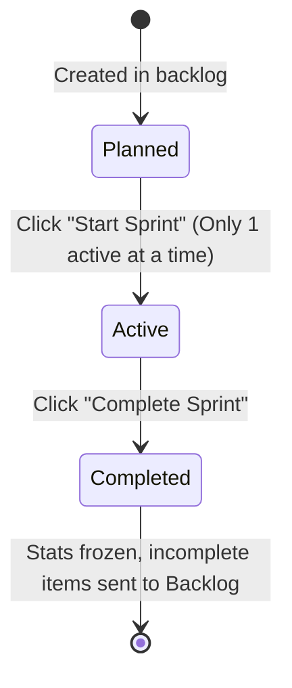

# Sprints & Planning

Sprints in Wekraft are time-boxed execution periods—typically spanning 1 to 2 weeks—during which your team commits to delivering a set of planned tasks and resolving open issues.

---

## The Sprint Lifecycle

Every sprint transitions through exactly three states:

1. **Planned**: Sprints are created from the Sprints dashboard. Developers can drag tasks from the backlog list into the sprint scope.
2. **Active**: Work begins. Wekraft monitors task movements. **Only one sprint can be active per project.**
3. **Completed**: The sprint is closed by the owner or administrator. Wekraft automatically performs cleanups:
   - Freezes the completion rates for velocity analytics.
   - Automatically returns any incomplete tasks or open issues back to the project **Backlog**.

---

## Starting and Monitoring Sprints

To activate a sprint:
1. Go to the **Sprint** tab in the workspace.
2. Select your planned sprint.
3. Click **Start Sprint**.

During an active sprint, the dashboard renders live statistics:
- **Velocity Tracker**: Measures task completion rate.
- **Sprint Burndown**: Displays remaining work relative to the timeline.
- **Overdue Alerts**: Highlights tasks approaching the sprint end date.

---

## Next Steps

- Define your backlog items in [Tasks & Backlog](/web/docs/tasks).
- View how tasks lay out in the [Project Calendar](/web/docs/calendar).
- Track project timelines in the [Project Delivery Timeline & Gantt Chart](/web/docs/time-logs).
