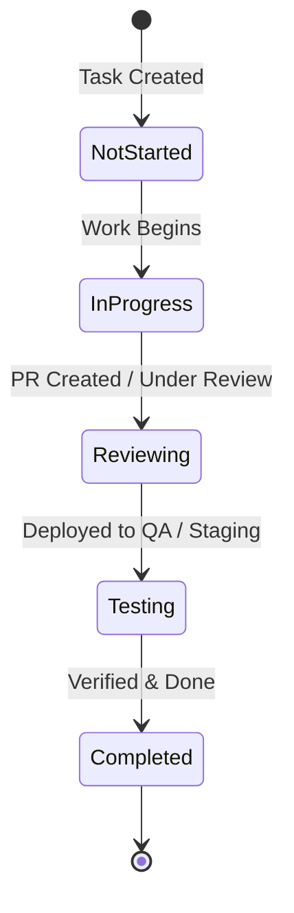

# Tasks & Backlog

Tasks in WeKraft are the primary planning units used to organize product backlogs, map engineering work, and execute sprint goals. This document provides a detailed reference of task properties, lifecycles, and database integration rules.

---

## Sub-topics

To help you manage tasks and backlog items, see the following operational guides:

- **[Create Tasks](/web/docs/create-tasks)**: Step-by-step instructions on creating tasks, setting priorities, estimating dates, and adding attachments.
- **[Edit Tasks](/web/docs/edit-tasks)**: How to transition task statuses, manage items in List/Board/Table layouts, and link codebase paths.
- **[Assign Tasks](/web/docs/assign-tasks)**: How to assign tasks, track active developer workloads, and manage permissions.

---

## Task Properties

Every task contains the following properties:

- **Title**: A description of the work to be done.
- **Description**: Optional details about the requirements or checklist items.
- **Priority**: Urgency classifications set as High, Medium, or Low.
- **Status**: The workflow state representing the phase of execution (see Lifecycle).
- **Estimation**: The planned start and end dates for the task.
- **Is Blocked**: An indicator showing whether the task is blocked by an open issue.
- **Codebase Link**: Optional reference to a repository file.
- **Sprint Association**: Optional reference pointing to a time-boxed sprint.
- **Attachments**: Optional files or assets uploaded to the task.

---

## Task Workflow & Lifecycle

Tasks move through a standard linear state machine. Status updates trigger automatic database recalculations, including developer workloads and active sprint burn rates.

1. **Not Started (`not started`)**: Task is parked in the backlog or active sprint.
2. **In Progress (`inprogress`)**: A developer has accepted the task and is actively writing code.
3. **Reviewing (`reviewing`)**: Development is complete; work is awaiting pull request approval or peer reviews.
4. **Testing (`testing`)**: The feature has been built and is undergoing validation on dev or staging builds.
5. **Completed (`completed`)**: The task is fully delivered. Marking completion sets the completion timestamp and logs the resolver's user ID.
