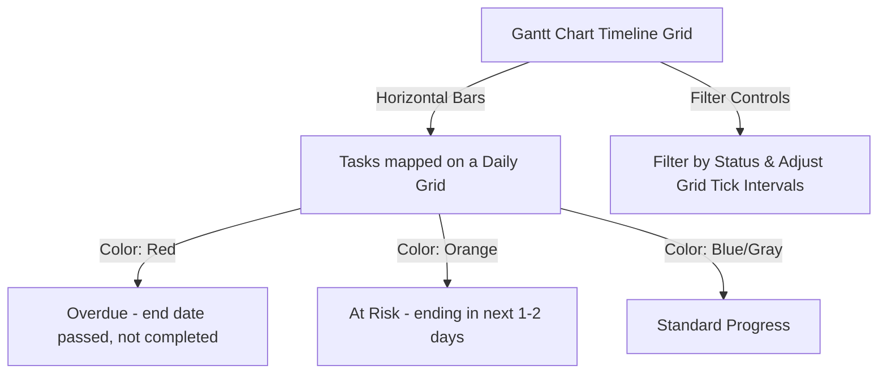

# Project Timeline & Gantt Chart

The **Time Logs** page (accessed via the `Time Logs` workspace sidebar tab) functions as Wekraft's **Project Delivery Timeline & Gantt Chart**. Rather than tracking billable hours or stopwatch timers, this page serves as an automated delivery calibration tool that visualizes your sprint tasks against the project's target deadline.

---

## Workspace Prerequisites

For Wekraft to track and render project timeline metrics:
1. The **Project Owner** must set a target delivery date (deadline) for the project.
2. If no deadline is set, the timeline will show a *"Deadline not set"* screen, prompting you to set one using the **"set Deadline"** dialog.

---

## Top Dashboard Metrics

Once the deadline is set, Wekraft calculates three performance cards at the top of the timeline:

### 1. Milestone Trajectory
- **Purpose**: Evaluates whether current task velocities align with your final deadline.
- **Inputs**: Analyzes sprint completion logs, start dates, and time elapsed.

### 2. Delay Debt
- **Purpose**: Highlights tasks and issues that have slipped past their due dates.
- **Overdue Threshold**: Requires **more than 5 tasks** with set due dates in your project to establish a tracking baseline. If you have fewer than 5 tasks, it displays a helper prompt.
- **Details**:
  - Displays total accumulated **Days Overdue**.
  - Renders a **"Worst Offenders"** list sorting overdue tasks and issues by severity.

### 3. Pace Tracker
- **Purpose**: Calculates the team's output rate.
- **Goal**: Helps project managers determine if scope expansion or scheduling delays are threatening the target delivery window.

---

## The Gantt Chart Timeline Grid (`ProjectTimeline.tsx`)

Below the metric cards sits the interactive Gantt chart:

### Visual Task Bars
Each task is rendered on a daily timeline grid based on its `estimation` window:
- **Red Bar**: Overdue task (estimated end date is in the past, and status is not `completed`).
- **Amber / Orange Bar**: At-risk task (estimated end date is approaching in the next 48 hours).
- **Blue / Dark Bar**: Stable task progress.
- **Duration Badge**: Shows the task's span (e.g., `5d` for five days).
- **Teammate Avatars**: Renders stacked avatar icons of all assigned developers directly on the Gantt bar.

### Grid Controls
The Gantt header includes tools to filter and focus your view:
- **Filter by Status**: Toggle dropdown to display only `not started`, `inprogress`, `reviewing`, or `testing` tasks.
- **Grid Intervals**: Switch tick intervals (e.g., `2 Days`, `3 Days`, `5 Days` or `10 Days` ticks) to compress or expand the horizontal layout.
- **Hover Tooltips**: Hovering over any task bar reveals its full title, dates, and a list of all assigned team members.

---

## Next Steps

- Check the codebase overlays in [Repository Heatmaps](/web/docs/heatmaps).
- Plan task dates in [Tasks & Backlog](/web/docs/tasks).
- Organize sprint dates in [Sprints & Planning](/web/docs/sprints).
