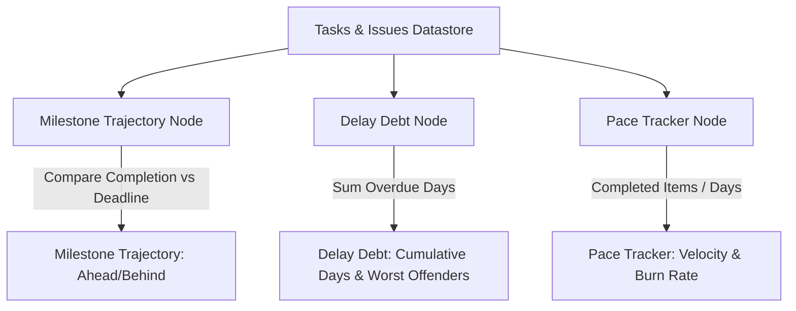

# Project Timeline & Gantt Chart

The **Time Logs** module (accessed via the workspace sidebar under **Manage → Time Logs**) acts as WeKraft's project delivery timeline. Combining Gantt chart visualizations with delivery metrics, this page tracks schedule variance, accumulated delay debt, and task progress relative to your target deadline.

---

## Technical Prerequisites & Configuration

Timeline tracking requires a project deadline to establish a calendar baseline:
1. **Target Date Storage**: The target deadline is stored in the project details document under the target date field (as a Unix millisecond timestamp).
2. **Setup Prompt**: If the target date is undefined, the workspace timeline displays a setup message, prompting the project owner to specify a delivery date.
3. **Calculation Epoch**: Once set, the system calculates duration deltas between the project's inception timestamp and the target date to calibrate progress charts.

---

## Top Dashboard Metrics

WeKraft computes three real-time schedule analytics cards at the top of the Time Logs panel:

### 1. Milestone Trajectory
- **Logic**: Compares your task completion rate against the timeline slope to the target date.
- **Output**: Returns a status (e.g., `Ahead of Schedule`, `On Track`, or `Behind Schedule`) based on the remaining backlog volume.

### 2. Delay Debt
- **Logic**: Measures the schedule slippage of uncompleted items.
- **Threshold**: Activates when **5 or more tasks** have defined end dates. If the task count is below this threshold, the dashboard prompts the team to populate task estimation dates.
- **Calculations**:
  - **Cumulative Delay**: Sum of `(CurrentDate - Task.estimation.endDate)` for all active tasks where `status !== "completed"` and `endDate < CurrentDate`.
  - **Worst Offenders**: Evaluates and lists active tasks and issues with past-due dates, sorted by priority (`critical` and `high` priority items first) to highlight bottlenecks.

### 3. Pace Tracker
- **Logic**: Measures the average time elapsed per completed task (`finalCompletedAt` - `createdAt`).
- **Purpose**: Provides managers with early warnings regarding scope expansion, indicating if the current task output velocity is sufficient to meet the final deadline.

---

## The Gantt Chart Timeline Grid

WeKraft provides a horizontal Gantt chart built on a reactive timeline grid.

### 1. Daily Grid Rendering
Tasks with defined start and end dates are projected horizontally across a calendar grid. 

### 2. Reactive Color Indicators
Gantt bars dynamically update colors based on deadline compliance:
- **Red Bar (Overdue)**: Estimated end date is in the past, and task status is not completed.
- **Orange/Amber Bar (At Risk)**: Estimated end date falls within the next 48 hours, and task status is not completed.
- **Blue/Gray/Accent Bar (Stable)**: Standard progress within the estimation window.
- **Avatar Stacking**: Stacked avatar circles represent the assigned developers.

### 3. Interactive Toolbar Controls
- **Status Filtering**: Filter the timeline view to hide completed tasks, focusing only on active bottlenecks (`not started`, `inprogress`, `reviewing`, `testing`).
- **Interval Ticks**: Adjust grid ticks (e.g., `2 Days`, `3 Days`, `5 Days`, or `10 Days` columns) to customize the horizontal calendar zoom level.
- **Detail Tooltips**: Hovering over a Gantt bar fetches full titles, assignee lists, and status metadata without leaving the view.
